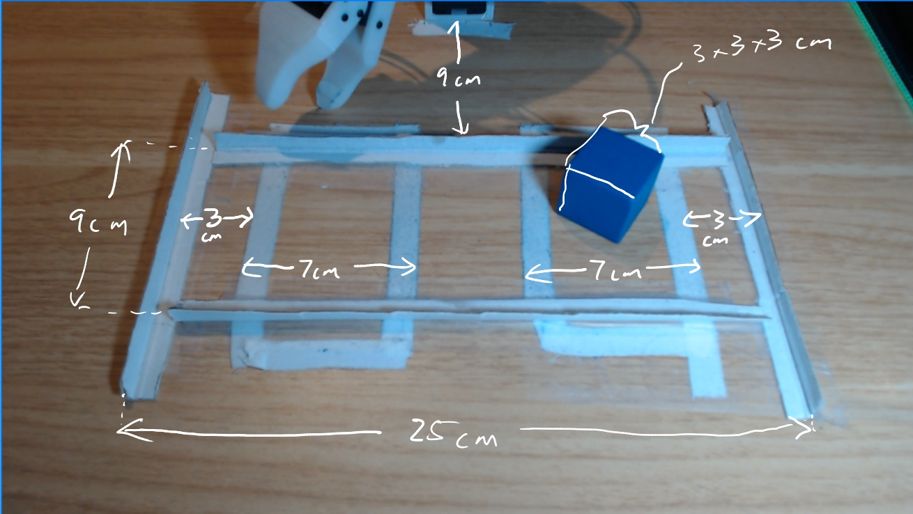

<h1 align="center">
    
LeRobot Hackathon • October 2024

    Real World RL by Alexander Soare
</h1>

_This branch of the [LeRobot](https://github.com/huggingface/lerobot) project will be used for the [LeRobot Hackathon of October 2024](https://github.com/huggingface/lerobot_hackathon_oct2024)._

## The Goal

We'll experiment with [LeRobot's TD-MPC](./lerobot/common/policies/tdmpc/modeling_tdmpc.py), starting from a [baseline setup that I've already validated](https://x.com/asoare159/status/1834246102297510301). From there, we'll try to see if we can do something more impressive and interesting.

## Required materials and workspace setup

You'll need to get materials and set up your workspace like so:

Here's what we see in the image:
- The base of a **Koch v1.0 robot** is at the top of the image.
  - Note: You can also use the Koch v1.1, Moss v1.0, or S0-100.
- The **blue cube (3x3x3 cm)** will be pushed around by the robot arm. It's important that nothing else is blue in the scene, as we will be using simple color segmentation code to segment out the cube. You can use a different color if you want, you'll just need to tweak the segmentation params.
- The two smaller rectangular regions inside the larger one are the goal regions for the cube (they alternate). Use any means you want to outline the goal regions in your setup. **I used white sports tape**.
- The outside rectangular region forms the boundaries of the cube's world. Use any means you want to set this up. **I used white cardboard strips with a longitudinal fold in the middle**.
  - Note: It's important that this has some height to it to prevent the cube going out of bounds. But it should be so high that the arm can't push against the cube from outside, when the cube is up against the edge.
  - Note: Notice that my rails are long enough for me to make the cube's workspace large if I want. I just need to translate the bottom rail down, and the top rail up a bit.

## Code

I'll highlight the main changes and additions relative to the main LeRobot fork. The code is far from perfect and is quite hacky in places:

- `rl.py`: Reward calculation and environment reset.
- `lerobot/scripts/record_episodes.py`: Alternative to `control_robot.py` used in `main` for recording offline datasets.
- `lerobot/common/dataset/online_buffer.py`: Uses LeRobotDatasetV2 which is not yet in `main`.
- `lerobot/scripts/train.py`: Updated to use the real robot environment instead of sim environments. Maybe has some minor improvements on the online RL loop. Uses LeRobotDatsetV2.
- `lerobot/scripts/eval_real.py`: Instead of `eval.py` in `main`. It does the rollout on a real robot instead of a sim environment.
- `lerobot/common/policies/rollout_wrapper.py`: Special logic for running inference asynchronously and managing observation and action queues. Makes it possible to roll out a policy even if inference time is slower than the control loop. I've also added a `run_inference` method to the TD-MPC policy, which is used by the wrapper.
- `lerobot/scripts/create_goal_masks.py`: Used to draw the goal regions for the cube.
- `lerobot/scripts/teleop_with_goals.py`: Teleop the robot and visualize the reward.

## Specific resources (about this task)

Here are some quick tutorials on some of the steps we'll need to do to set up and run our experiments.

Goal mask creation: https://youtu.be/EXv4F3_cjBA

Verifying the goal mask: https://youtu.be/ugY9WlYZNp0

Verifying the reward function and workspace bounds: https://youtu.be/FG4Fa2ISmrQ

How the segmentation algorithm (for getting the cube location for calculating the reward) works: https://youtu.be/S4WzHskRg-0

Basics of recording a dataset: https://youtu.be/R9PsRLHPQPk

How the policy outputs are scaled: https://youtu.be/t1T0RoY9syg

Getting started with training: https://youtu.be/NNP4pIjHZqM

## General resources (about TD-MPC)

You can look into the TD-MPC family:
- [TD-MPC paper](https://arxiv.org/abs/2203.04955). TD-MPC is the core algorithm we'll be using.
- [FOWM project page](https://www.yunhaifeng.com/FOWM/). Some tweaks/improvements to TD-MPC. This is what our code follows.
- [TD-MPC2 project page](https://www.tdmpc2.com/). We won't be going this way, but just out of interest.
- [LeRobot Tech Talk by Nicklas Hansen (first author TD-MPC)](https://www.youtube.com/watch?v=5d9W0I2mpNg)
- Coming soon... my own video with a deep dive explanation of how TD-MPC works.
